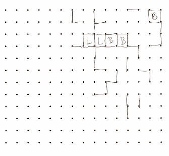

# Welcome to My Portfolio

## My Projects

### Find the Number

  

    
A number-finding game built in Python using Pygame. It includes multiple rounds, interactive line drawing, sound feedback, and game logic that ends on incorrect selections.

    

      <button onclick="document.getElementById('demo1').style.display='block'">Demo</button>
      

        <video width="100%" height="auto" controls>
          <source src="FindNumberDemo.mov" type="video/mp4">
          Your browser does not support the video tag.
        </video>
      

      <a href="https://github.com/yourusername/hangman" target="_blank"><button>Code</button></a>
    

  

  

---

### Connect the Dots

  

    
An interactive game where players take turns drawing lines to complete squares. Built in Kivy, this project highlights turn-based gameplay, dynamic UI updates, and scoring logic.

    

      <button onclick="document.getElementById('demo2').style.display='block'">Demo</button>
      

        <video width="100%" height="auto" controls>
          <source src="demoVideo.mp4" type="video/mp4">
          Your browser does not support the video tag.
        </video>
      

      <a href="https://github.com/yourusername/connect-the-dots" target="_blank"><button>Code</button></a>
    

  

  

---

## About Me (click to show/hide)

  
Click to expand

  

    I am a Montessori educator turned software engineer passionate about purpose-driven tech. I bring empathy, rapid learning, and creativity into every line of code. With a strong background in Python, AI, and frontend development, I create tools that solve real problems and inspire curiosity.
  

