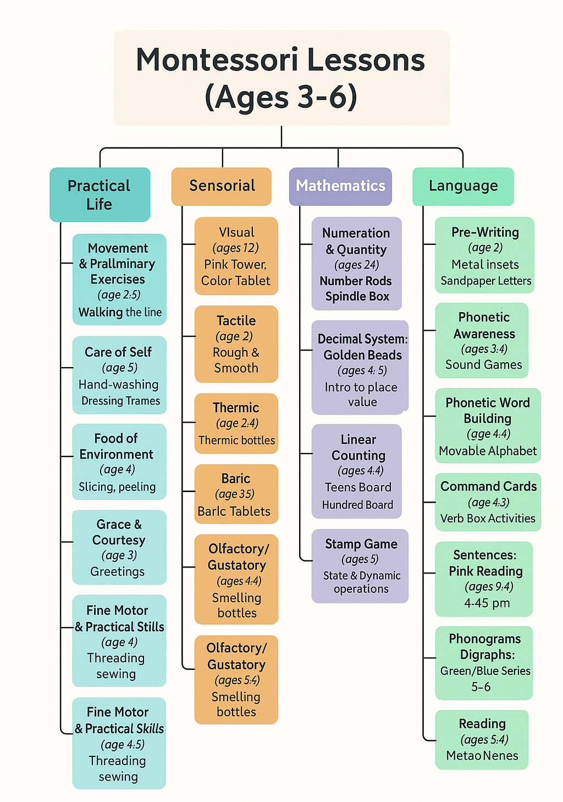
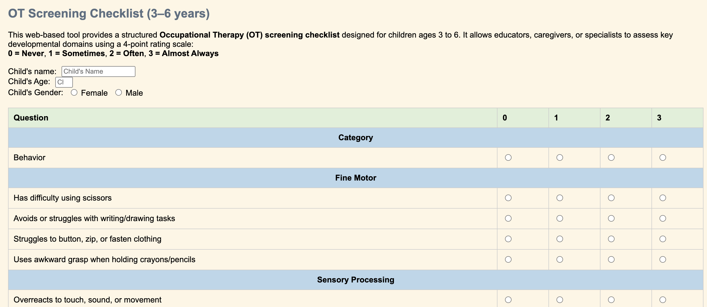
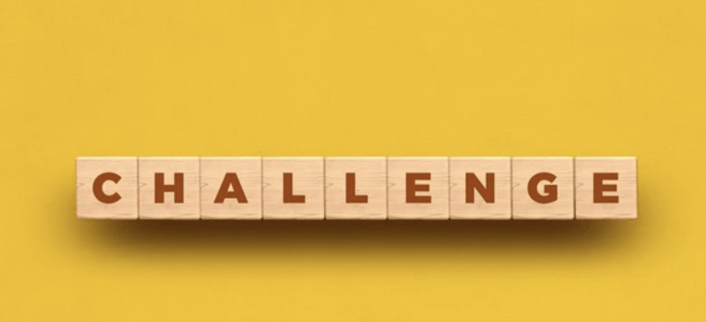
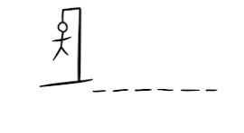
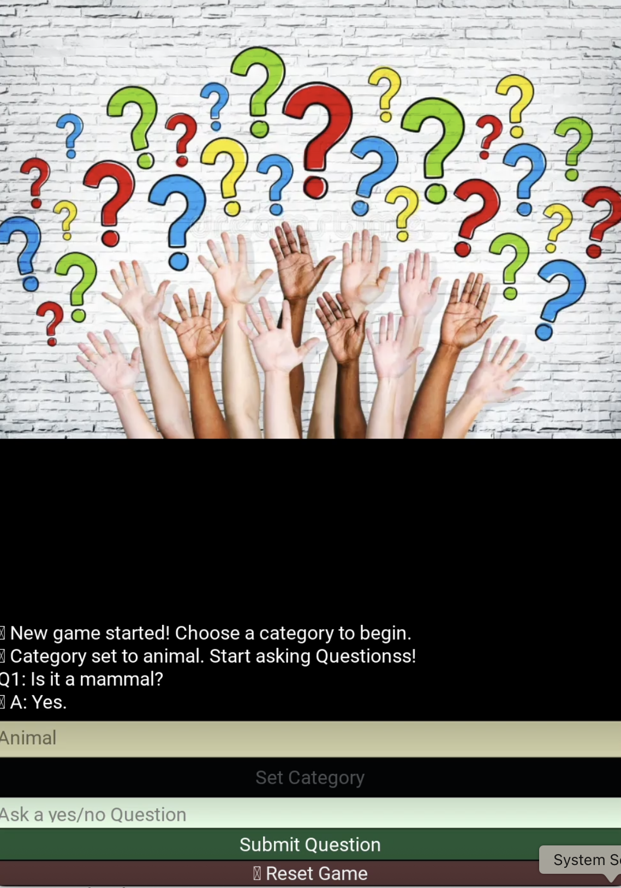
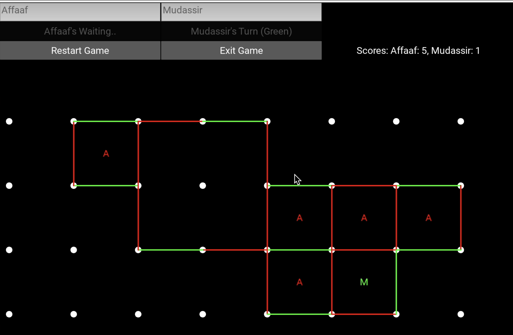
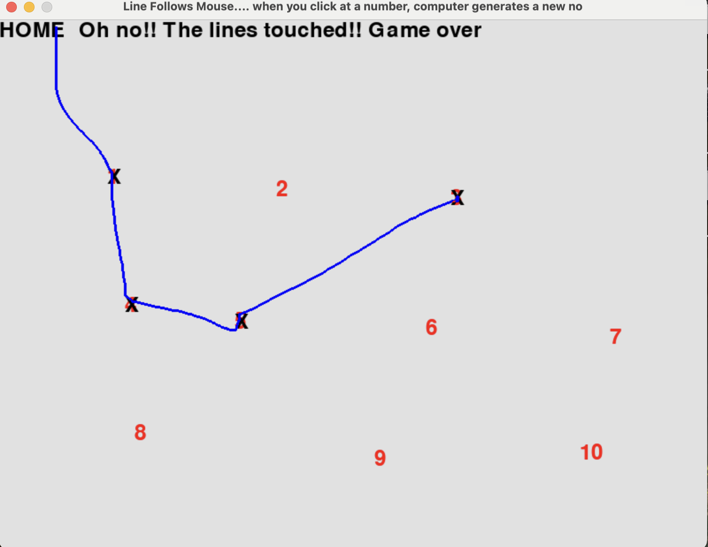

# Welcome to My Portfolio

## About Me

  <button onclick="document.getElementById('demo7').style.display='block'">Resume</button>

  Purpose-driven Software Engineer with a strong foundation in full-stack development and AI programming, skilled in Python, ChatGPT, and n8n. Brings a human-centered approach to technology, shaped by a background in Montessori leadership. Proven track record of improving team efficiency, surpassing performance benchmarks, and enhancing engagement through thoughtful design and structured systems. Passion for operational excellence, proactive problem-solving, and a user-first mindset, building inclusive, impactful technology solutions.

  

    <h4>Enrichment Initiative</h4>
    
75%

  

  

    <h4>Growth in Key Metrics</h4>
    
80%

  

  

    <h4>Team Collaboration</h4>
    
80%

  

## My Projects

 <!-- Another Project Card -->
  

    <h3>Montessori Lessons Recommender</h3>
    
    
A full-stack web application that helps Montessori educators recommend age-appropriate lessons for children based on their learning history. Built with Flask (Python) and SQLite for the backend and vanilla JavaScript/HTML/CSS for the frontend, the app features:

    <ul>
      <li>A dynamic form to input child details and mastered lessons.</li>
      <li>Real-time lesson name suggestions with autocomplete</li>
      <li>Automatic recommendation of the next appropriate lesson</li>
      <li>Visual breakdown of mastered vs. unmastered lessons</li>
      <li>Integrated Montessori lesson flowchart for reference</li>
    </ul>
    
This tool streamlines lesson planning and supports personalized learning paths in Montessori classrooms.

    

      <button onclick="document.getElementById('demo1').style.display='block'">Demo</button>
    

    

      <video width="100%" height="auto" controls muted autoplay>
        <source src="MontessoriLessonsDemo.mov" type="video/mp4">
        Your browser does not support the video tag.
      </video>
    

    

      JavaScript
      Python
     Flask
    

  

  
  <!-- Another Project Card -->
  

    <h3>✈️ Travel Reminder</h3>
    
    
An intelligent travel assistant built using <strong>n8n</strong>, this project automates the task of reminding travelers about their upcoming trips and enriches the experience with destination-specific suggestions. The workflow checks travel dates from stored documents, identifies travelers with an upcoming trip, and automatically sends a personalized email reminder a day before departure.

    
The system is:

    <ul>
      <li><strong>Efficient</strong>: Automatically parses and processes travel data daily.</li>
      <li><strong>Smart</strong>: Matches travel destinations with curated local recommendations.</li>
      <li><strong>Reliable</strong>: Uses n8n’s powerful scheduling and automation.</li>
      <li><strong>Scalable</strong>: Easily extendable to include weather forecasts and local events.</li>
    </ul>
    

      <button onclick="document.getElementById('demo8').style.display='block'">Demo</button>
    

    

      <video width="100%" height="auto" controls muted autoplay>
        <source src="DemoTravelReminder.mov" type="video/mp4">
        Your browser does not support the video tag.
      </video>
    

    

      n8n
      Automation
      Node.js
    

  

  <h3>📝 Notes Taker – Voice Recorder</h3>
  
  

    <strong>NotesTaker</strong> is a web-based tool designed specifically for educators to streamline their observation process. It allows teachers to record, transcribe, and save voice notes linked to individual children for efficient documentation and review.
  

  <ul>
    <li>🎙️ <strong>Record:</strong> Capture voice notes directly in the browser</li>
    <li>🧠 <strong>Preview:</strong> Automatically transcribe and edit your note</li>
    <li>💾 <strong>Save:</strong> Securely store each note under the selected child's profile</li>
    <li>📜 <strong>Review:</strong> Instantly access all past notes for a child</li>
  </ul>
  
<strong>Workflow:</strong>

  <ol>
    <li>Select an existing child or add a new profile</li>
    <li>Record your observation using the built-in voice recorder</li>
    <li>Preview and edit the generated transcript</li>
    <li>Submit the note to store it in the database</li>
    <li>Access previous entries anytime for reference</li>
  </ol>
  

      <button onclick="document.getElementById('demo3').style.display='block'">Demo</button>
    

    

      <video width="100%" height="auto" controls muted autoplay>
        <source src="DemoNotesTaker.mov" type="video/mp4">
        Your browser does not support the video tag.
      </video>
    

    

      JavaScript
    

    <h3>Screening</h3>
    
    
A digital screening program to identify potential developmental and sensory needs in children aged 3–6. The tool allows teachers to input classroom observations and instantly generates a structured report highlighting areas of concern. This can help: 

    <ul>
      <li>Early intervention efforts</li>
      <li>Improved communication with parents</li>
      <li>Supported more personalized learning approaches</li>
      <li>Empowers educators to track patterns over time and take proactive steps with greater clarity</li>
    </ul>
    
This tool streamlines lesson planning and supports personalized learning paths in Montessori classrooms.

    

      <button onclick="document.getElementById('demo2').style.display='block'">Demo</button>
    

    

      <video width="100%" height="auto" controls muted autoplay>
        <source src="Screening.mov" type="video/mp4">
        Your browser does not support the video tag.
      </video>
    

    

      JavaScript
    

  

  
  <!-- Another Project Card -->
  

    <h3>📝 Word Builder Challenge</h3>
    
    
A one-minute word game where players build valid words using only the letters from a long given word. Includes live word validation and scoring. Built in Python with a focus on string handling, timers, and dictionary APIs. This short and engaging game can enhance:

<ul>
      <li>Enhance Vocabulary</li>
      <li>Improve Spelling Skills since it encourages accurate spelling and real-time dictionary validation</li>
      <li>Boost Cognitive Agility as the timer adds pressure and improves focus</li>
      <li>Learn Word Formation as they become aware of prefixes, suffixes and letter patterns</li>
      <li>Brain warm-ups</li>
    </ul>
  
    

      <button onclick="document.getElementById('demo7').style.display='block'">Demo</button>
    

    

      <video width="100%" height="auto" controls muted autoplay>
        <source src="DemoGenWords.mov" type="video/mp4">
        Your browser does not support the video tag.
      </video>
    

    

      Python
      Kivy
      Game Design
    

  

  <!-- Project Card -->
  

    <h3>🔤 Hangman</h3>
    
    
A simple word-guessing game built with Python and Pygame. Players guess letters to uncover a hidden word before the hangman is fully drawn. Features include random word selection, visual feedback, and mouse-based letter interaction.

    

      <button onclick="document.getElementById('demo10').style.display='block'">Demo</button>
    

    

      <video width="100%" height="auto" controls muted autoplay>
        <source src="hangman.mp4" type="video/mp4">
        Your browser does not support the video tag.
      </video>
    

    

      Python
      Game Design
      Pygame
    

  

  <!-- Another Project Card -->
  

    <h3>🧠 20 Questions Game</h3>
    
    
A classic interactive guessing game where the human beings tries to determine what the computer is thinking of by asking a series of yes/no questions. The goal is for the human beings to guess the correct object, person, or concept in 20 questions or fewer. Its can help in developing: 

   <ul>
    <il>Critical Thinking </il>
    <il>Logical Reasoning – The game encourages deductive thinking and step-by-step elimination based on limited information.
</il>
    <il>Language Development – Formulating clear yes/no questions improves question structure, vocabulary, and clarity.</il>
    <il>Memory and Categorization – Players must mentally organize information and recall previous questions to avoid repetition.</il>
    <il>Patience and Focus – Success requires attention to detail and thoughtful decision-making over impulsive guessing.</il>
   </ul>
    

      <button onclick="document.getElementById('demo11').style.display='block'">Demo</button>
    

    

      <video width="100%" height="auto" controls muted autoplay>
        <source src="Demo20Questions.mov" type="video/mp4">
        Your browser does not support the video tag.
      </video>
    

    

      Kivy
      AI
      Game Design
      Python
    

  

  <!-- Another Project Card -->
  

    <h3>🧠 Connect the Dots</h3>
    
    
A game where players can take turns drawing lines to complete squares or play independently. Built in Kivy, this project highlights turn-based gameplay, dynamic UI updates, and scoring logic. This helps in: 

   <ul>
      <li>Strategic Thinking – Players learn to plan ahead and anticipate opponents’ moves to gain an advantage.</li>
      <li>Visual-Spatial Reasoning – Completing squares sharpens the ability to recognize patterns and use space effectively.</li>
    </ul>
    

      <button onclick="document.getElementById('demo12').style.display='block'">Demo</button>
    

    

      <video width="100%" height="auto" controls muted autoplay>
        <source src="demoVideo.mp4" type="video/mp4">
        Your browser does not support the video tag.
      </video>
    

    

      Game Design
      Kivy
      Python
    

  

 <!-- Project Card -->
  

    <h3>Find the Number</h3>
    
    
A number-finding game built in Python using Pygame. It includes multiple rounds, interactive line drawing, sound feedback, and game logic that ends on incorrect selections.

    

      <button onclick="document.getElementById('demo9').style.display='block'">Demo</button>
    

    

      <video width="100%" height="auto" controls muted autoplay>
        <source src="FindNumberDemo.mov" type="video/mp4">
        Your browser does not support the video tag.
      </video>
    

    

      Python
      Game Design
      Pygame
    

  

